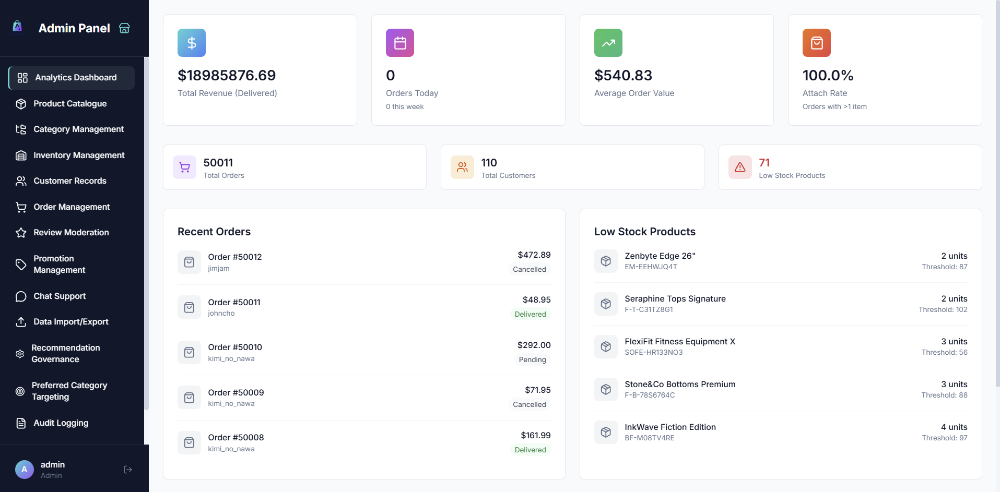
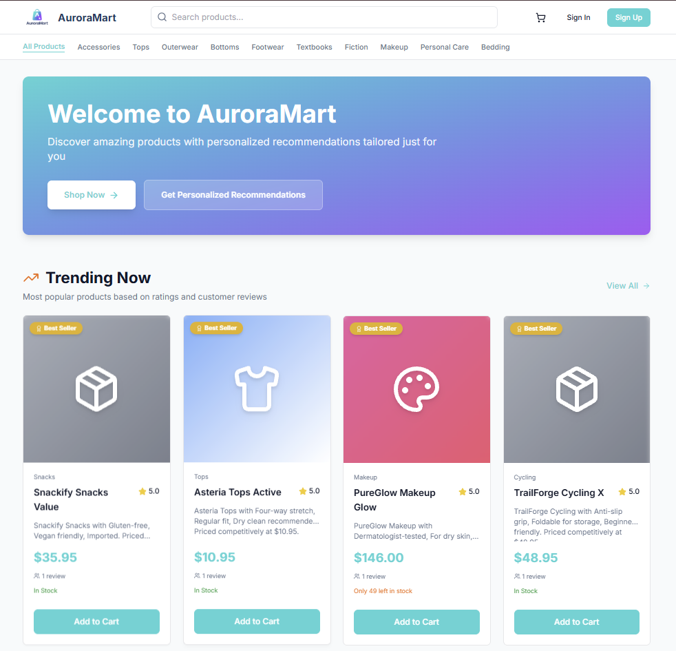
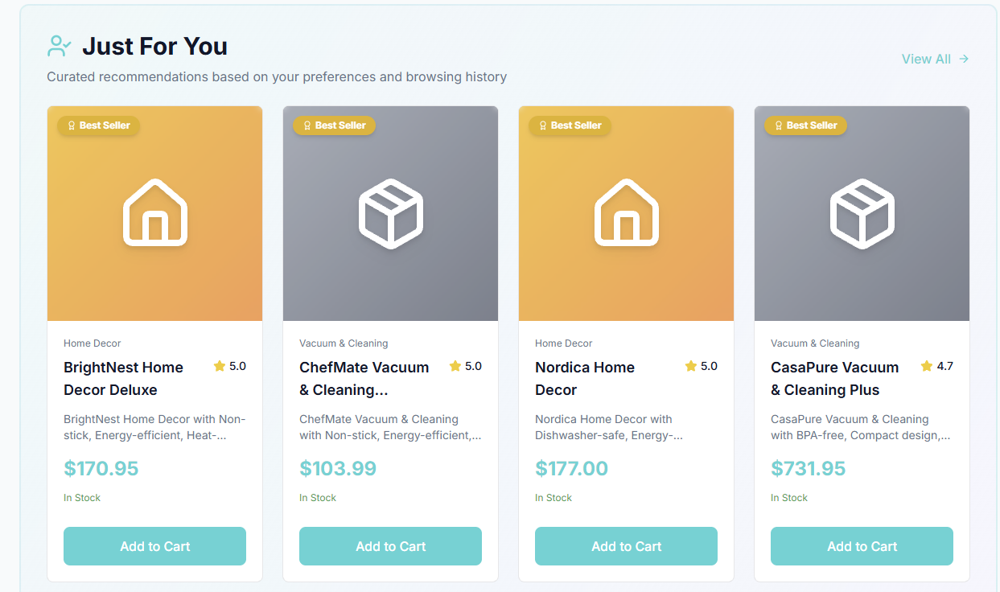
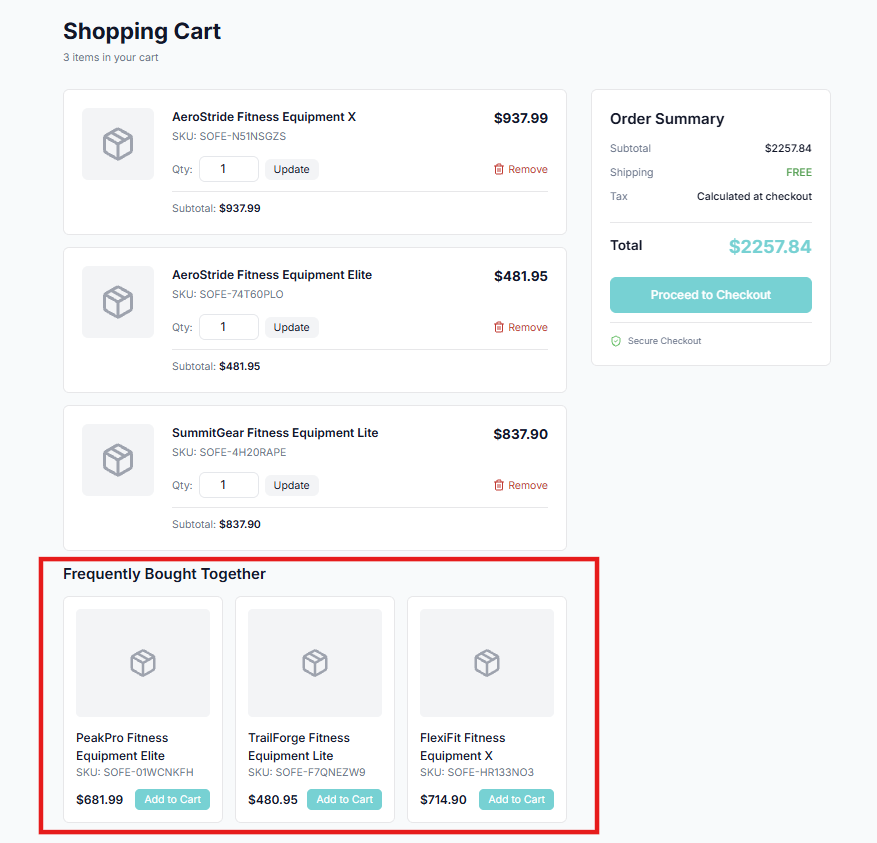
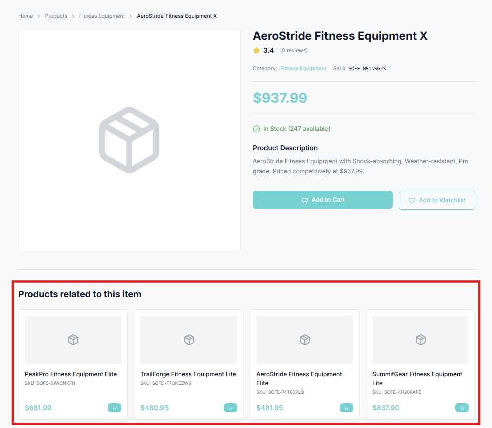
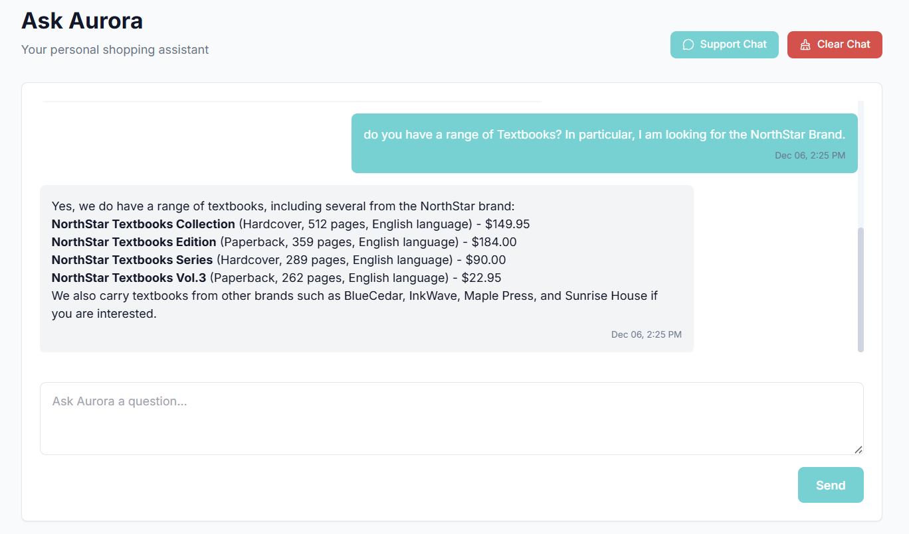

# AuroraMart – Personalised E-commerce Platform
AuroraMart is a full-stack B2C e-commerce web application built with **Python**, **Django**, and integrated **machine learning models**.  
It was developed for [IS2108 Full-stack Software Engineering for AI Solutions I](https://nusmods.com/courses/IS2108/full-stack-software-engineering-for-ai-solutions-i).

---

## 🚀 Project Objectives

AuroraMart aims to validate a core business hypothesis:

> Deliver hyper-relevant product recommendations and encourage return visits within 14–21 days.

To achieve this, the application integrates:

- A **cold-start personalisation model** (Decision Tree)
- **Association rule–based recommendations**
- A clean, maintainable Django architecture
- A functional admin + storefront experience

---

## ✨ Features

### 🎛 Admin Panel
- Manage the product catalogue (500 SKUs)  
- Update stock and inventory  
- Maintain customer profiles

 <p align="center">
   
 </p>

### 🛒 Customer Storefront
- Browse curated categories & subcategories  
- View product details with ratings, stock, and pricing  
- Add items to cart and update quantities  
- AI-powered recommendations:  
  - **Frequently Bought Together**  
  - **Complete the Set** (cart suggestions)  
  - **Next Best Action** (category-page nudges)
 
 <p align="center">
   
 </p>

### 🤖 AI Integration

#### Cold-Start Personalisation
- Inputs: demographic information (eg. age, gender etc.)
- Output: predicted preferred product category  
- Home Page contains personalised recommendations based on the customer's preferred product category

<table>
  <tr>
    <td align="center">
      <strong>Home page: Category Based Recommendations</strong><br />
      
    </td>
  </tr>
</table>

#### Association Rules
- Derived from 50,000 historical transactions  
- Provides context-aware cross-sell and upsell suggestions  

<table>
  <tr>
    <td align="center">
      <strong>Cart page recommendations (Complete the Set)</strong><br />
      
    </td>
    <td align="center">
      <strong>Product page recommendations (Frequently Bought Together)</strong><br />
      
    </td>
  </tr>
</table>

#### Aurora Chatbot
- Instant AI assistance for general queries related to orders, products, policies, and troubleshooting.
- Retrieval-Augmented Generation (RAG) pipeline that retrieves relevant product, order, and FAQ context before generating an answer.
- Session-based chat system that stores message history per customer for continuity.
- Fallback to human support via the existing Support Messages system when issues require staff involvement.

<table>
  <tr>
    <td align="center">
      <strong>Aurora Chatbot</strong><br />
      
    </td>
  </tr>
</table>

---

## 📦 Tech Stack

**Backend:**  
- Python 3.x  
- Django  
- SQLite (default)

**Machine Learning:**  
- joblib  
- scikit-learn  
- Apriori/association rules (pre-computed)
- Gemini

**Frontend:**  
- HTML, CSS, JavaScript  
- Django templates  

---

## 🔧 Setup & Installation

### Prerequisites
- Python 3.8+
- pip
- Git

### Step 1: Clone & Install Dependencies
```bash
git clone https://github.com/happyweijie/AuroraMart.git
cd AuroraMart/auroramart
pip install -r ../requirements.txt
```

### Step 2: Create the .env File
AuroraMart uses environment variables to store configuration values and sensitive keys.

1. Create a ```.env``` file inside the project root (auroramart/):
```
cd auroramart
touch .env
```
2. Add the required environment variables:
```
# Gemini API Key
GEMINI_API_KEY=your_gemini_api_key_here
```
3. Make sure your Django settings load this ```.env``` file (using ```dotenv``` as configured in the project).

### Step 3: Download & Install ML Models
1. **Download** `mlmodels.zip` from the shared resource [link](https://drive.google.com/drive/folders/1Z4bYzfEztsYPZP7CKW4WAy6kSoJ37Dab?usp=sharing).
2. **Extract** the zip file.
3. **Copy** the extracted folder into the `admin_panel` app directory:
   ```bash
   # Copy mlmodels folder to admin_panel/
   cp -r path/to/mlmodels admin_panel/
   ```
   Your structure should look like:
   ```
   admin_panel/
   ├── mlmodels/
   │   ├── b2c_customers_100.joblib
   │   ├── b2c_products_500_transactions_50k.joblib
   ├── models.py
   ├── views.py
   └── ...
   ```

### Step 4: Load Database & Sample Data
1. **Run migrations** to set up the database schema:
   ```bash
   python manage.py migrate
   ```

2. **Download** `data.json` from the shared resource [link](https://drive.google.com/drive/folders/1Z4bYzfEztsYPZP7CKW4WAy6kSoJ37Dab?usp=sharing).

3. **Load** the sample data (including 500 products, categories, and transactions):
   ```bash
   python manage.py loaddata data.json
   ```

### Step 5: Create a Superuser (Optional)
If you need to create your own admin account:
```bash
python manage.py createsuperuser
```

**Or use the pre-loaded admin credentials:**
- **Username:** `admin`
- **Password:** `P@55W0RD`

### Step 6: Run the Development Server
```bash
python manage.py runserver
```

Access the application:
- **Storefront:** [http://localhost:8000/](http://localhost:8000/)
- **Admin Panel:** [http://localhost/panel/login](http://localhost:8000/panel/login)

---
